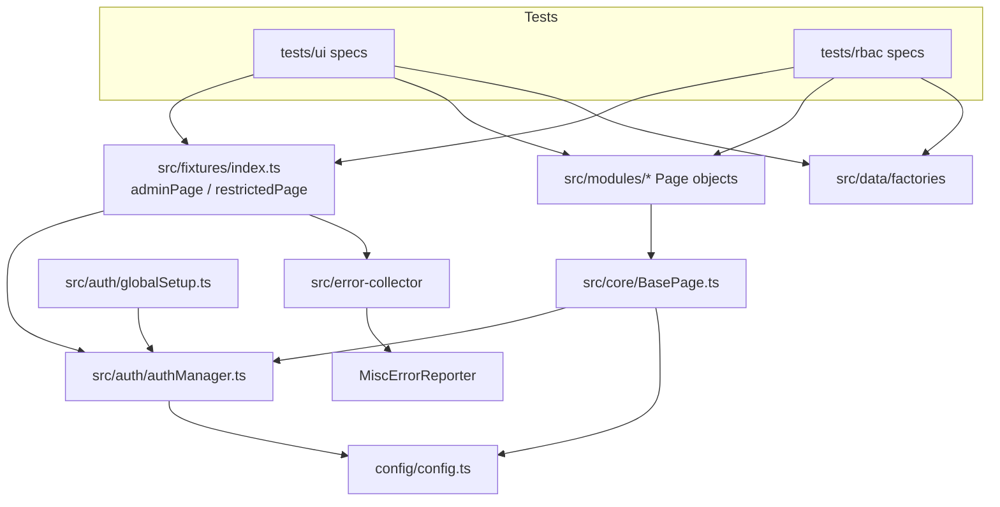
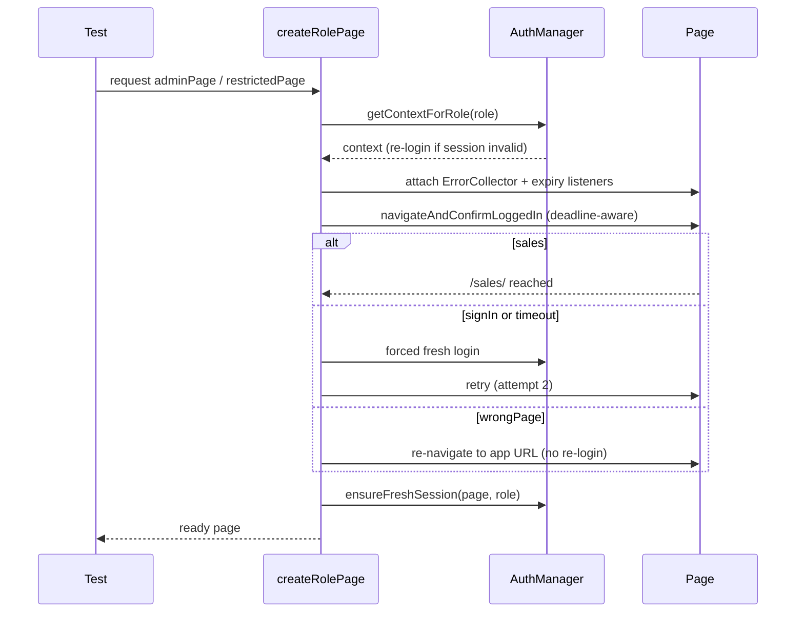
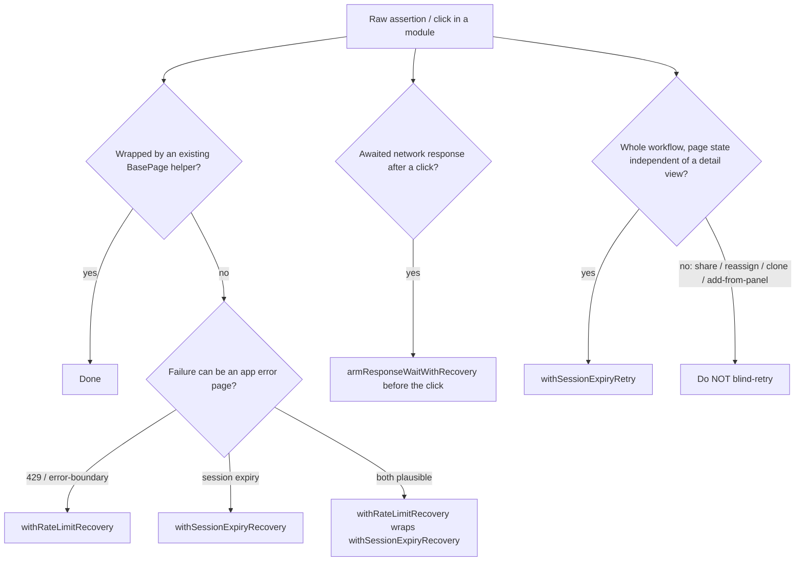
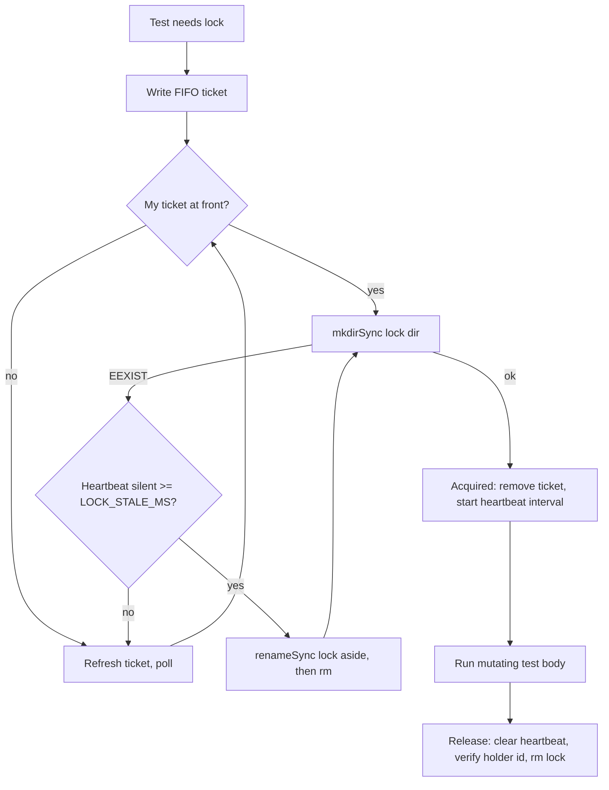
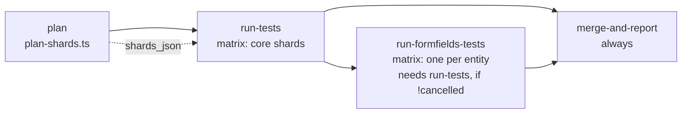

# Architecture

> **Purpose:** How the framework is built — layers, fixtures, auth, recovery combinators, locking, sharding and CI flow. The single place to learn the shape of the system before changing it.
> **Read when:** Touching `src/core`, `src/fixtures`, `src/auth`, the error collector, a lock, or a CI workflow; or onboarding to a module you have not worked in.
> **Size budget:** 40k chars (hard cap 60k)
> **Last verified:** 2026-10-09 @ cbfdbd1

Rules and do/don't mechanics live in [PATTERNS.md](./PATTERNS.md); incident history in [known-issues/](./known-issues/session-expiry-and-auth.md); CI detail in [CI_PIPELINES.md](./CI_PIPELINES.md). Terms: [GLOSSARY.md](./GLOSSARY.md).

## 1. Suite at a glance

<!-- GEN:suite-totals:START -->
**932 tests** in **35 spec files** (UI 509 · RBAC 423)
<!-- GEN:suite-totals:END -->

<!-- GEN:module-table:START -->
| Module | UI tests | RBAC tests | Total |
|---|---:|---:|---:|
| Call-logs | 30 | 28 | 58 |
| Companies | 23 | 26 | 49 |
| Companies — Field Limits | 39 | 31 | 70 |
| Contacts | 23 | 23 | 46 |
| Contacts — Field Limits | 42 | 28 | 70 |
| Dashboard | 34 | 29 | 63 |
| Deals | 26 | 30 | 56 |
| Deals — Field Limits | 39 | 31 | 70 |
| Leads | 25 | 31 | 56 |
| Leads — Field Limits | 42 | 25 | 67 |
| Meetings | 19 | 12 | 31 |
| ProductsAndServices | 9 | 7 | 16 |
| ProductsAndServices — Field Limits | 39 | 31 | 70 |
| Quotations | 24 | 17 | 41 |
| Reports | 38 | 27 | 65 |
| Tasks | 18 | 16 | 34 |
| Tasks — Field Limits | 39 | 31 | 70 |
| **Total** | **509** | **423** | **932** |
<!-- GEN:module-table:END -->

## 2. Repository layout

| Path | Role |
|---|---|
| `config/config.ts` | Single source of truth for env vars, timeouts, `searchRetry`/`meetingRetry`, and `buildApiUrl()`. Also `expected-test-counts.json` (suite baseline) and `sharedConfigSuites.json` (shared-config suites the planner excludes). |
| `src/core/BasePage.ts` | Base class of every page object: bounded click/fill, recovery combinators, entity list/detail readiness, custom-field helpers, react-select helpers. |
| `src/modules/<module>/<Module>Page.ts` | One page object per module (call-logs, companies, contacts, dashboard, deals, formFields, leads, meetings, productsAndServices, quotations, reports, tasks). `dashboard/` also holds `LoginPage.ts`. |
| `src/fixtures/index.ts` | `adminPage`, `restrictedPage`, `adminContext`, `restrictedContext`. Always import `test`/`expect` from here (sole exception: `tests/ui/dashboard/login.spec.ts`). |
| `src/auth/` | `globalSetup.ts` (logins + product fixtures), `authManager.ts`, `productFixtureNeed.ts`, `storageStates/<env>/<role>.json`. |
| `src/data/factories/<module>Factory.ts` | Data generators + per-module custom-field constants. `src/data/productFixtureAccessor.ts` reads the per-run Products & Services fixture file. |
| `src/error-collector/` | `ErrorCollector.ts` (per-worker singleton) and `errorFilters.ts` (classification). |
| `src/reporters/MiscErrorReporter.ts` | Merges per-worker error files into `reports/<env>/misc-errors.json`. |
| `src/notifications/` | Report parsing, run history, failure analysis, email — see [REPORTING.md](./REPORTING.md). |
| `src/utils/` | `logger.ts` (never `console.*`), `navigation.ts` (`safeWaitForURL`), `dateHelpers.ts`, `sensitiveFieldPattern.ts`. |
| `tests/ui/<module>/`, `tests/rbac/<module>.rbac.spec.ts`, `tests/rbac/formFields/` | UI specs (admin) and RBAC specs (admin + restricted). `tests/ui/formFields/` also holds the lock modules. |
| `scripts/` | Guards and tooling (`check-test-conventions`, `check-test-counts`, `plan-shards`, `new-module`, `check-docs`, `update-doc-numbers`) and `scripts/hooks/` (git + Claude Code hooks). |
| `.github/workflows/`, `Jenkinsfile*`, `.github/scripts/detect-tests.sh` | CI. |

## 3. Page objects

Every page object extends `BasePage` and keeps this exact section order: (1) `retryConfig` (reads `config.searchRetry` or `config.meetingRetry`), (2) locators, (3) constructor (`super(page)`), (4) private helpers, (5) navigation, (6) form actions, (7) search & open, (8) edit actions, (9) assertions, (10) workflow wrappers. Locators are lazily evaluated arrow functions (`private readonly foo = (): Locator => ...`) — the element may not exist at construction time. No locator ever lives in a spec file. `scripts/new-module.ts` scaffolds this shape. Fixed order exists so anyone can find retry tuning at the top and workflows at the bottom.

## 4. Fixtures

`adminPage`/`restrictedPage` share one `createRolePage()` lifecycle:

1. Obtain a context via `AuthManager.getContextForRole(role)` (re-logs-in transparently if the saved session is dead).
2. Attach `ErrorCollector` listeners (`pageerror`, console `error`, `requestfailed`, responses `>=400`) and a session-expiry listener *before* the first navigation.
3. `navigateAndConfirmLoggedIn()` races the landing and classifies it as one of four `NavOutcome`s:
   `sales` (landed on `/sales/` — proceed), `signIn` (session dead — forced fresh login, retry), `wrongPage` (valid session, other same-origin page, e.g. the app resumed a `/setup/...` section — cheap in-place re-navigation, no re-login), `timeout` (nothing matched — expensive full re-login). `isSessionExpiryPage()` is consulted before `wrongPage` so the "Forbidden" bootstrap page gets the right remedy.
4. Dismiss the startup popup (`#cancel[data-dismiss="modal"]`) if present.
5. On CI, stagger `restrictedPage` startup by a random 0–3s.
6. `AuthManager.ensureFreshSession()` proactively refreshes a near-expiry token (wrapped in try/catch; never fails the test).

All waits in setup are **deadline-aware**: one deadline = `Date.now() + testInfo.timeout × SETUP_DEADLINE_FRACTION` (0.85); each wait is capped at the time remaining and the outer 2-attempt loop fails fast with a diagnostic when the remaining budget cannot support another attempt, rather than being killed opaquely by Playwright's own timeout. `adminContext`/`restrictedContext` are bare contexts from the saved storage state with none of this machinery.

## 5. Auth and sessions

`globalSetup.ts` runs once per invocation: logs in both roles, writes `src/auth/storageStates/<env>/<role>.json` and `userNames.json`, and creates Products & Services fixtures only when the invocation may run a spec that needs them (`productFixtureNeed.ts`). `AuthManager`:

- Login is `PUT {apiBaseUrl}/users/login` → `{token}`, a JWT stored verbatim in `localStorage.token`; every API call sends `Authorization: Bearer <payload.data.accessToken>`. **No cookie session** — clearing `localStorage` alone redirects to `/signIn`.
- Session validity is cached in memory per role for `SESSION_CACHE_MS` (30 min).
- Storage-state writes go through `withFileLock()` (`fs.mkdirSync`-based atomic lock) with a write-temp-then-`renameSync` — two workers racing a re-login cannot corrupt the file. (It does not prevent a *session-level* collision when two workers of one role re-login; see [session-expiry-and-auth](./known-issues/session-expiry-and-auth.md).)
- `config.buildApiUrl(path)` is the **only** URL normalizer (strips trailing slashes, appends `/v1` only if absent). Never hand-roll another.
- Real JWT lifetime varies between observations; do not treat any one figure as constant (open item in [KNOWN_ISSUES_ACTIVE.md](./KNOWN_ISSUES_ACTIVE.md)).

## 6. Recovery combinators

Three failure shapes replace a screen mid-test; each has one shared combinator in `BasePage`. Do not add a fourth ad-hoc mechanism — extend these.

| Failure | Detector | Combinator | Remedy |
|---|---|---|---|
| Session expired (`/signIn` redirect, "Forbidden" bootstrap page, 401) | `authManager.isSessionExpiryPage()` | `withSessionExpiryRecovery()` (single assertion); `withSessionExpiryRetry()` (whole workflow, once); `armResponseWaitWithRecovery()` (arm a `waitForResponse` before a click) | Headless re-login, re-navigate, retry |
| App 429 "Whoa! Too many requests" page | `isRateLimitedPage()` | `withRateLimitRecovery()` | Reload and retry once |
| App error-boundary "Something is broken here" | `isAppErrorBoundaryPage()` | same `withRateLimitRecovery()` (identical remedy) | Reload and retry once |

Compose rate-limit **outside** session-expiry: `withRateLimitRecovery(() => withSessionExpiryRecovery(() => …))` (exemplar `FormFieldsConfigPage.open()`). Recovery outcomes are recorded via `ErrorCollector.recordRecoveryEvent()` for the email's load-signal table. `page.route()`/`route.fetch()` interception is confirmed unusable against this backend — do not use it for recovery. Decision record: [ADR-0008](./adr/0008-error-page-recovery.md); history: [session-expiry-and-auth](./known-issues/session-expiry-and-auth.md), [rate-limits-and-error-pages](./known-issues/rate-limits-and-error-pages.md).

## 7. Data factories

`generateXxxData()` (plain Faker; a restricted user's own record), `generateAdminXxxData()` (`ADM<timestamp>` prefix; admin-only), `generateSharedXxxData()` (`SHR<timestamp>`; created to be shared). QA/staging data is never cleaned up, so a plain Faker name can collide with leftovers and yield a false RBAC pass; the prefix+timestamp makes every run's records uniquely searchable and classifiable. `Country` defaults to `India` (CRM validation requirement). Factory property names follow the real API field, never the on-screen label ([PATTERNS](./PATTERNS.md) §Data).

## 8. Custom fields

Lead, Contact, Deal and Company each carry admin-configured custom fields (Text, Paragraph, Number, PickList, MultiPickList, Checkbox, Date, DateTimePicker, URL; plus Company/Contact Lookup on Lead). They are environment-conditional. `BasePage` holds the generic fill/select/assert helpers keyed by the raw Kylas **internal name** (`cfTextField`), never the display label (labels are admin-renamable; internal names are immutable). Each module owns a `<MODULE>_CUSTOM_FIELD_NAMES` constant in its factory plus thin `fill…CustomFields()`/`assert…CustomFieldsOnDetail()` wrappers. Every helper presence-checks first (`isCustomFieldPresent()`), logs and skips when absent, never throws. Suffix style (`legacy` `_input_customFieldValues.cf<Name>` vs `plain` `_input_cf<Name>`) is a typed parameter. `BasePage.fillAddressViaGpsOrManual()` tries the live Google-Places-style GPS lookup, falling back to a manual address.

## 9. Error collection

`ErrorCollector` is attached by the fixtures to every role page and passively records `pageerror`, console `error`, `requestfailed` and HTTP `>=400`. `errorFilters.ts` classifies each into one of three buckets before it reaches `reports/<env>/misc-errors.json`:

1. **Noise** (`isNoise()`) — dropped: third-party scripts, HTTP 429, `net::ERR_ABORTED` on enumerated background endpoints (`ABORT_ON_NAVIGATE_PATTERNS`, including the Settings > Fields list GETs; an HTTP 4xx/5xx on the same URL is still reported).
2. **Expected RBAC** (`isExpectedRbacError()`) — the CRM correctly denying a restricted user (422/`029003`, and Products' 403/`00902001`); counted, shown, never a regression.
3. **Known background noise** (`isExpectedBackgroundNoise()`) — a narrow, individually live-confirmed endpoint list. Never extend without the same evidence bar; entity CRUD/search/layout endpoints are deliberately excluded.

Anything else is "unexpected". Per-worker files merge in `MiscErrorReporter`/`scripts/merge-misc-errors.ts`. The report file is overwritten by every later invocation in the same env — copy anything you need to keep.

## 10. Retry configuration

`config.searchRetry` (per-env count + wait) drives every `searchAndOpen*`/`retryFind*`; `config.meetingRetry` is longer (calendar aggregation is slower). Never hardcode a count or loop a blind wait; size per environment from measured latency. Playwright `retries` comes from `config.execution.retryCount`; CI sets `--workers` on the CLI, which always overrides `playwright.config.ts`/`WORKERS`.

## 11. Cross-process locking

Shared, account-wide config (Form Field Limits) is mutated by tests in different files and worker processes. `tests/ui/formFields/formFieldLockFactory.ts` → `createFormFieldLock(entityKey)` provides one lock per entity (`<entity>FormFieldLock.ts` wrap it into a lock-wrapped `test`; Lead's original `formFieldsTestLock.ts` is left as-is). Mechanics: `fs.mkdirSync` mutual exclusion; the holder rewrites `heartbeatAtMs` every `LOCK_HEARTBEAT_INTERVAL_MS`; a waiter treats the lock as abandoned only when the heartbeat has been silent for `LOCK_STALE_MS`, and claims it by atomic `renameSync` (never blind `rm`); FIFO ticket queue gives fairness, tickets refreshed while polling and pruned after `TICKET_STALE_MS`. Only config-**mutating** tests acquire it; read-only tests use plain `baseTest`. **A file lock only protects one filesystem** — sharded CI shards are separate VMs, hence the carve-out in §12. Decisions: [ADR-0005](./adr/0005-heartbeat-based-lock.md), [ADR-0001](./adr/0001-dedicated-custom-fields.md); history: [sharding-and-locks](./known-issues/sharding-and-locks.md).

## 12. Sharding and CI flow

With `fullyParallel: true`, same-file tests are **not** guaranteed to share a shard; only `test.describe.configure({ mode: 'serial' })` keeps a block atomic. For the qa/stage/main (and escalated sandbox) workflows:

- `scripts/plan-shards.ts` discovers tests with `--list`, **excludes shared-config suites** (paths from `config/sharedConfigSuites.json`, a file, not a CLI flag), and bin-packs the remaining **spec files** first-fit-decreasing into a per-shard test budget — a file is never split. Output (`shards_json`) feeds the `run-tests` matrix; each shard receives explicit file paths.
- The `formFields` suites run in a separate **fixed matrix** (`run-formfields-tests`), one shard per entity, each running that entity's UI+RBAC pair together. The matrix list must match `sharedConfigSuites.json` (`scripts/check-formfields-matrix-sync.ts`).
- `run-formfields-tests` is sequenced **after** the core shards (`needs: [run-tests]`, `if: ${{ !cancelled() }}`) to cut concurrent `globalSetup` load; `merge-and-report` merges blob reports and sends one notification. Decisions: [ADR-0002](./adr/0002-formfields-carve-out-from-sharding.md), [ADR-0003](./adr/0003-file-atomic-shard-planner.md), [ADR-0006](./adr/0006-serial-sub-blocks.md), [ADR-0007](./adr/0007-sequence-formfields-after-core.md).

<!-- GEN:shard-plan:START -->
| Scope | Core shards (file-atomic) | Tests per core shard | formFields shards (fixed, one per entity) |
|---|---:|---|---:|
| `--grep @regression` (qa, escalated sandbox) | 5 | 125 / 124 / 124 / 119 / 7 | 6 |
| full suite (stage, main) | 5 | 125 / 124 / 125 / 125 / 16 | 6 |
<!-- GEN:shard-plan:END -->

Per-pipeline triggers, scopes and worker counts (generated, never hand-typed):

<!-- GEN:workflow-matrix:START -->
| Pipeline file | Trigger | Scope (`--grep`) | `--workers` | Sharded by planner |
|---|---|---|---|---|
| `dev.yml` | push → dev | @smoke | 1 | no |
| `main.yml` | manual | full suite / selective | 2 | yes |
| `prod.yml` | manual | @prodSafe | 2 | no |
| `qa.yml` | push → qa | @regression | 2 | yes |
| `sandbox.yml` | push → sandbox | full suite / selective | 2, dynamic | yes |
| `stage.yml` | push → stage + manual | full suite / selective | 2 | yes |
| `staging-promotion-gate.yml` | manual | full suite / selective | — | no |
| `Jenkinsfile` | Jenkins | @prodSafe, @regression, @smoke | 2 | no |
| `Jenkinsfile.prod` | Jenkins | @prodSafe | 2 | no |
| `Jenkinsfile.qa` | Jenkins | @regression | 2 | no |
| `Jenkinsfile.sandbox` | Jenkins | full suite / selective | 1 | no |
| `Jenkinsfile.staging` | Jenkins | full suite / selective | 2 | no |
<!-- GEN:workflow-matrix:END -->

Details, secrets and failure handling: [CI_PIPELINES.md](./CI_PIPELINES.md).

## 13. Products & Services — deliberate deviations

It lives under `/setup/products-services/...` (not `/sales/`), has no detail page (`edit/{id}` is the only per-record page), uses three fresh-per-run fixtures instead of per-test data, and its RBAC denial is HTTP 403/`00902001`. These are intentional — do not normalize them. See [products-and-services](./known-issues/products-and-services.md).
