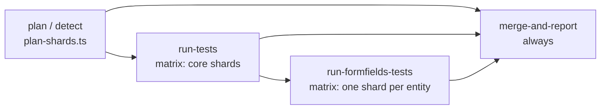

# CI Pipelines

> **Purpose:** How this repo's CI is built — the four sharded GitHub workflows, the shard planner, the formFields carve-out and its sequencing, the other pipelines, required secrets, and timeouts.
> **Read when:** Editing any `.github/workflows/*`, `Jenkinsfile*` or `scripts/plan-shards.ts`; judging whether "CI is green" actually covers your change; adding a shared-config test suite.
> **Size budget:** 40k chars (hard cap 60k)
> **Last verified:** 2026-10-08 @ 2fa56be

All figures in tables below are generated (`npm run docs:refresh`), never hand-typed. If a number looks wrong, refresh; do not edit it.

## 1. Suite size right now

<!-- GEN:suite-totals:START -->
**932 tests** in **35 spec files** (UI 509 · RBAC 423)
<!-- GEN:suite-totals:END -->

<!-- GEN:tag-counts:START -->
`@smoke` 51 · `@regression` 898 · `@prodSafe` 55
<!-- GEN:tag-counts:END -->

## 2. Pipeline matrix (generated from the workflow / Jenkinsfile text)

<!-- GEN:workflow-matrix:START -->
| Pipeline file | Trigger | Scope (`--grep`) | `--workers` | Sharded by planner |
|---|---|---|---|---|
| `dev.yml` | push → dev | @smoke | 1 | no |
| `main.yml` | manual | full suite / selective | 2 | yes |
| `prod.yml` | manual | @prodSafe | 2 | no |
| `qa.yml` | push → qa | @regression | 2 | yes |
| `sandbox.yml` | push → sandbox | full suite / selective | 2, dynamic | yes |
| `stage.yml` | push → stage + manual | full suite / selective | 2 | yes |
| `staging-promotion-gate.yml` | manual | full suite / selective | — | no |
| `Jenkinsfile` | Jenkins | @prodSafe, @regression, @smoke | 2 | no |
| `Jenkinsfile.prod` | Jenkins | @prodSafe | 2 | no |
| `Jenkinsfile.qa` | Jenkins | @regression | 2 | no |
| `Jenkinsfile.sandbox` | Jenkins | full suite / selective | 1 | no |
| `Jenkinsfile.staging` | Jenkins | full suite / selective | 2 | no |
<!-- GEN:workflow-matrix:END -->

CLI `--workers` always wins over `playwright.config.ts` and the `WORKERS` env var. `staging-promotion-gate.yml` passes no `--workers`, so it is the one path where `WORKERS` is actually read. "Sandbox" workers are decided at runtime (`dynamic`).

## 3. Branch strategy and which pipeline protects what

```
feature/* → dev → qa → stage → prod → main        sandbox = pre-PR check, reset to dev each time
```

| Branch | Primary CI | Scope (from the workflow, verified) |
|---|---|---|
| `sandbox` | `sandbox.yml` (push) | Selective via `.github/scripts/detect-tests.sh`; escalates to `--grep @regression` when core files change; falls back to `@smoke` with no changed files |
| `dev` | `dev.yml` (push) | `@smoke` |
| `qa` | `qa.yml` (push) | `@regression` |
| `stage` | `stage.yml` (push + manual) | Full suite, no `--grep` |
| `prod` | base `Jenkinsfile` (branch `prod`) | `@prodSafe`. `prod.yml` is a manual fallback (`workflow_dispatch`) |
| `main` | base `Jenkinsfile` (branch `main`) | Full suite, no `--grep`. `main.yml` is manual only and also runs the full suite |

Jenkins: only the base `Jenkinsfile` has branch triggers (`prod`/`main`/`sandbox`, plus manual); `Jenkinsfile.qa`, `.staging`, `.prod`, `.sandbox` are manual-only fallbacks. Jenkins agents are `agent any`, so there is no cross-agent sharding there. `staging-promotion-gate.yml` is a different file from `stage.yml`: manual-only, runs against `STAGING_*` secrets, then after a human approval in the `production-approval` GitHub Environment auto-merges `staging` into `prod`. Treat its blast radius accordingly.

"CI passed" means different things per branch (rule 23 in CLAUDE.md): dev proves smoke only; qa proves `@regression`; only stage / main / the Jenkins `main` run prove the full suite.

## 4. The four sharded workflows (`qa.yml`, `stage.yml`, `main.yml`, `sandbox.yml`)

GitHub-hosted jobs have a hard, non-configurable 6-hour ceiling; `timeout-minutes` above 360 does nothing. A single-job run of the regression/full suite exceeded it and was killed. Sharding is the structural fix.



| Job | Needs | Runs when | `timeout-minutes` |
|---|---|---|---|
| `plan` (`detect` in sandbox) | none | always | 15 (`plan`); sandbox `detect`: no explicit value |
| `run-tests` | `plan` / `detect` | all plan outputs present (sandbox: also `run_scoped_tests == 'true'`, i.e. skipped when only formFields was selected) | 180 |
| `run-formfields-tests` | `run-tests` (sandbox: `detect`, `run-tests`) | `!cancelled()`, i.e. after core shards finish in ANY result; sandbox also requires `run_formfields_track == 'true'` | 180 |
| `reset-field-config` | `run-tests`, `run-formfields-tests` | `always()` (sandbox: also `run_formfields_track == 'true'`) | 35 job / 25 step |
| `merge-and-report` | all of the above incl. `reset-field-config` | `always()` | 30 |

- **Why formFields runs after core, not beside it:** both tracks starting together put every core and formFields job through `globalSetup` against one backend at once, which produced 429s. `needs` alone would skip formFields on any core failure, so `if: !cancelled()` is required. Cost: wall-clock roughly doubles. Decision record: [ADR 0007](./adr/0007-sequence-formfields-after-core.md).
- **`merge-and-report`:** downloads every shard's blob report, `npx playwright merge-reports --config=merge.config.ts`, aggregates misc-errors (`scripts/merge-misc-errors.ts`), then `npm run history:sync || true` and `npm run notify || true`. `allure-playwright` is deliberately excluded from the merge config. See [REPORTING.md](./REPORTING.md).
- **`reset-field-config`** (qa, stage, main, sandbox; not `prod.yml`): after both tracks it runs `npm run reset:field-config -- --env <env>` (main adds `--confirm-prod`, `environment: production`) to blank the 18 dedicated form-field limits, uploads artifact `field-config-reset-<env>`. Job- and step-level `continue-on-error`, the step always exits 0; `merge-and-report` downloads the artifact with a `continue-on-error` step. [ADR 0009](./adr/0009-field-config-reset-and-account-lock.md). Unproven: see "Open" below.
- **Concurrency groups** (`cancel-in-progress: false`): `kylas-qa` (`qa.yml`), `kylas-staging` (`stage.yml`, `sandbox.yml`), `kylas-prod` (`main.yml`, `prod.yml`). `dev.yml`, Jenkins jobs and `staging-promotion-gate.yml` are not in any group.
- **Open (not facts, [KI-34](./KNOWN_ISSUES_ACTIVE.md)):** whether job-level `continue-on-error` protects the run conclusion on a job timeout; whether an approval-waiting run holds its group; whether `main.yml` needs a separate approval for the reset job (then `merge-and-report` waits); `always()` after force-cancel; a pending `stage` run can be displaced by a `sandbox` push. Timeouts 25/35 min are guesses; `merge-and-report` now waits up to that long.
- Every shard uploads `blob-report-*`, `misc-errors-*` and `playwright-test-results-*` artifacts; the merged report is `playwright-report-<env>`.

### 4.1 Shard planner (`scripts/plan-shards.ts`)

Replaces Playwright's blind count-based `--shard=N/M`. It runs `playwright test --list --reporter=json`, drops every file under the shared-config suites' directories, then first-fit-decreasing bin-packs the remaining spec FILES into bins of at most 125 tests <!-- doc-figure-ok --> (`--tests-per-shard`, derived from measured throughput at 2 workers targeting ~90 min per shard). A file is never split. Output (`shard_total`, `shards_json`, `test_count`) goes to `$GITHUB_OUTPUT`, or to stdout locally. Current plan:

<!-- GEN:shard-plan:START -->
| Scope | Core shards (file-atomic) | Tests per core shard | formFields shards (fixed, one per entity) |
|---|---:|---|---:|
| `--grep @regression` (qa, escalated sandbox) | 5 | 125 / 124 / 124 / 119 / 7 | 6 |
| full suite (stage, main) | 5 | 125 / 124 / 125 / 125 / 16 | 6 |
<!-- GEN:shard-plan:END -->

Run it locally with `npx ts-node scripts/plan-shards.ts --grep @regression` (read-only). Decision record: [ADR 0003](./adr/0003-file-atomic-shard-planner.md).

### 4.2 formFields carve-out

The Form Field Limit tests mutate one shared, account-wide field configuration. A cross-process file lock only protects workers on the same filesystem, and each CI shard is its own VM, so a UI file and its RBAC file on different shards raced. The fix is structural:

- `config/sharedConfigSuites.json` lists the suite directories and entities. `plan-shards.ts` reads it for its exclusion, so no workflow edit can leak those files back into bin-packing.
- Each sharded workflow has a **fixed** `run-formfields-tests` matrix (`entity: [lead, contact, company, deal, task, productsAndServices]`), one shard per entity running that entity's UI + RBAC file pair together via explicit paths.
- `scripts/check-formfields-matrix-sync.ts` (`npm run check:formfields-matrix-sync`) fails if a workflow's matrix drifts from the JSON. Run it when adding an entity.
- Why not a dynamic matrix: it would add a `needs: plan` hop to a job that previously had none. Sandbox is the exception (its `detect` job is already a dependency).

Decision record: [ADR 0002](./adr/0002-formfields-carve-out-from-sharding.md); lock design: [ADR 0005](./adr/0005-heartbeat-based-lock.md); serial scoping: [ADR 0006](./adr/0006-serial-sub-blocks.md); dedicated fields: [ADR 0001](./adr/0001-dedicated-custom-fields.md). History: [known-issues/sharding-and-locks.md](./known-issues/sharding-and-locks.md).

### 4.3 Sandbox's two decide branches

`sandbox.yml`'s `detect` step runs `detect-tests.sh` to choose a target, then:

1. **Escalated** (`TARGET == "--grep @regression"`, triggered by changes under `src/core/`, `src/fixtures/`, `src/auth/`, `playwright.config.ts`, or critical `config/config.ts` edits): calls the planner and enables the formFields track.
2. **Selective** (any other target): planner-free (the planner would drop explicitly selected paths). `.github/scripts/split-formfields-target.sh` splits `$TARGET` by the `config/sharedConfigSuites.json` path prefixes (`tests/ui/formFields/`, `tests/rbac/formFields/`, not a grep substring): formFields paths go to the per-entity matrix (`run_formfields_track=true`, **all 6 entities**, since the matrix is fixed and the lock is per entity), the rest goes to `run-tests` as one `--shard=1/1` shard. The step fails loudly if formFields count + scoped count != original count (never run twice, never dropped). Since 2026-10-07; before that a formFields selection ran every formFields test as one job (run 37658909999).

| Case | `run_scoped_tests` | `run-tests` | `run-formfields-tests` (6 jobs) | blobs expected by `merge-and-report` |
|---|---|---|---|---|
| formFields only | false | skipped (not failed) | runs (`!cancelled()`) | 0 + 6 |
| formFields + other module | true | other module only, 1 shard | runs | 1 + 6 |
| escalated `@regression` | true | planner shards, formFields excluded | runs | N + 6 |
| no formFields (path target or `@smoke`) | true | as before | skipped | 1 |

`--grep @smoke` (fallback) still matches 18 `@smoke` formFields tests inside the single scoped shard; deliberately unchanged (small, read-only).

Workers: 2 when the rest-of-suite count is above 50, else 1; the formFields track is always 2. `detect-tests.sh` maps changed files to modules (module dir, `tests/ui/<m>/`, `tests/rbac/<m>.rbac.spec.ts` or `tests/rbac/<m>/`, factories via a singular→plural table) and also greps formFields specs for import dependencies (a page object/factory they import selects formFields too).

## 5. Other pipelines

- `dev.yml`: `@smoke`, one job, no sharding. `prod.yml`: `@prodSafe` only, manual, `environment: production`.
- `main.yml` jobs carry `environment: production`. If that environment has required reviewers, each job can raise its own approval prompt (not checkable from the repo).
- Base `Jenkinsfile`: per-stage timeouts (Checkout, Install, Setup Environment, Clear Auth State, Detect Tests) and a 24-hour `Approval Gate`; `Run Tests` computes its own timeout from the test count; the pipeline-wide timeout is a 48-hour backstop only, so it never needs syncing with suite growth. Branch → test selection is an if/else chain mirroring the GitHub workflows (dev `@smoke`, qa `@regression`, prod `@prodSafe`, sandbox via `detect-tests.sh`, others full).
- Every pipeline ends the same way: `npm run estimate-duration` (before tests), tests, `npm run history:sync`, `npm run notify`, archive the report.
- Git hooks in `scripts/hooks/` (`pre-commit`, `pre-push`) are installed into `.git/hooks/` (`core.hooksPath` is unset).

## 6. Required secrets and variables (names only)

GitHub Actions secrets (all via `secrets.*`; no `vars.*` are used):

| Group | Names |
|---|---|
| Per environment `QA_`, `STAGING_`, `PROD_` | `<PREFIX>_APP_URL`, `<PREFIX>_API_BASE_URL`, `<PREFIX>_ADMIN_EMAIL`, `<PREFIX>_ADMIN_PASSWORD`, `<PREFIX>_RESTRICTED_EMAIL`, `<PREFIX>_RESTRICTED_PASSWORD` |
| Notification | `GMAIL_USER`, `GMAIL_APP_PASSWORD` |
| History ledger / checkout | `PIPELINE_TOKEN` (needs push access to `ci/reporting-history`; every workflow running `history:sync` also needs `permissions: contents: write`) |

Jenkins binds the same names as credentials (`credentials('QA_ADMIN_EMAIL')`, etc.), plus `github-credentials` (username/password) for history sync. Only the active `ENV`'s variables are required at runtime (`config/config.ts` throws for missing ones of the active environment only). Optional runtime knobs: `ENV`, `WORKERS`, `RETRY_COUNT`, `NAVIGATION_TIMEOUT`, `EXPECT_TIMEOUT`, `DEFAULT_TIMEOUT`, `STALE_REPORT_THRESHOLD_HOURS`, `HISTORY_BRANCH_NAME`, `HISTORY_GIT_REMOTE`.

## 7. Open gaps (details in the active list)

- `concurrency:` groups now exist per account (section 4) but their runtime behaviour and the new reset job are unproven; see [KI-34](./KNOWN_ISSUES_ACTIVE.md). History: [sharding-and-locks.md](./known-issues/sharding-and-locks.md).
- The fixed formFields matrix does not scale with test growth; see [KNOWN_ISSUES_ACTIVE.md](./KNOWN_ISSUES_ACTIVE.md).

## 8. Changing CI safely

Workflow, `Jenkinsfile*` and `playwright.config.ts` edits affect every branch: prepare them as a diff for human review. Verify with `actionlint` (syntax only; it cannot prove runtime job-graph behavior, so the first real run is the proof), `npm run check:formfields-matrix-sync`, and a local `plan-shards.ts` run. Triage of CI failures: [RUNBOOK.md](./RUNBOOK.md). Past CI incidents: [known-issues/ci-pipelines.md](./known-issues/ci-pipelines.md), [known-issues/sharding-and-locks.md](./known-issues/sharding-and-locks.md).
