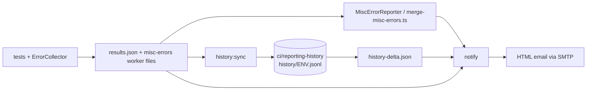

# Reporting and Notifications

> **Purpose:** How a test run becomes a summary email, a history ledger entry and a background-error report; what each `src/notifications` module owns.
> **Read when:** Changing anything under `src/notifications/`, `src/reporters/`, `src/error-collector/`, or `scripts/merge-misc-errors.ts`; debugging an odd email or an empty trend section.
> **Size budget:** 40k chars (hard cap 60k)
> **Last verified:** 2026-10-08 @ 4d0794a

## 1. Data flow

Local runs trigger `notify` through `posttest` (skipped when `$CI` is set). In CI each workflow or Jenkinsfile calls `history:sync` (before `notify`) and `notify` explicitly, both with `|| true` so reporting never fails a build. Sharded workflows merge shard blob reports and misc-errors first; see [CI_PIPELINES.md](./CI_PIPELINES.md).

## 2. Module ownership (`src/notifications/`)

| Module | Owns |
|---|---|
| `src/notifications/scripts/notify.ts` / `NotificationService.ts` | Orchestrates parse → history → analysis → render → send. Resolves branch/commit from CI env vars, then local `git`, then `unknown`. Freshness check. |
| `ReportParser.ts` | Parses Playwright's JSON report: totals, per-module stats (UI/RBAC split, retries genuine vs swept, slowest three tests), flaky tests, trace paths (last non-passing attempt for flaky), `error.stack`/`location`, ANSI stripping. Duration and start time come from `raw.stats`, not a sum of test durations. `deriveModuleFromFile()` is the single source of module display names. |
| `RunHistory.ts` | Pure logic: append/prune (`MAX_RECORDS_PER_ENV`), delta vs previous comparable run, recurring-flaky / recurring-failing (lookback and threshold constants), module trend and rolling module stability trend, slow-test regression, suite drift, duration estimate. |
| `FailureAnalyzer.ts` | Classifies each failure into a category and clusters only on a real shared signal (identical message, same source location, same endpoint + status). Never fuzzy-matches. |
| `FailureDetailBuilder.ts` | Enrichment: per-failure detail from history, the known-issues index and CI context. Raw fs access is isolated in a loader; derivation is pure. |
| `KnownIssuesIndex.ts` | Deterministic cross-reference of a failure against the issue docs. See §6. |
| `AutomationHealth.ts` | Weighted 0-100 score (Excellent / Good / Needs Attention / Critical) and the overall verdict, including `no-tests-executed` (checked first) and suite drift. Weights are documented starting heuristics, not tuned constants. |
| `JobStats.ts` | GitHub Actions only: Jobs API → per-job durations, total job-minutes (completed jobs only), time-overlap detection between jobs, per-shard recovery-event rows. Degrades to `null` on any failure. |
| `EmailTemplate.ts` | HTML renderer: an orchestrator plus one `buildXxx()` per section; carries `REPORT_ENGINE_VERSION`, independent of `package.json`. |
| `src/notifications/config/notificationConfig.ts`, `adapters/EmailAdapter.ts` | SMTP settings (Gmail, Zoho fallback) and recipient lists, per-branch first then per-environment. |
| `FieldConfigReset.ts` | Shared shape and loader for `reports/<env>/field-config-reset.json`, written by `scripts/reset-field-config.ts`; returns `null` on any problem so the email just omits the line. |
| `ShardCompleteness.ts` | Shape, parser and loader for `reports/<env>/shard-completeness.json` (expected vs merged shard reports, written by `.github/scripts/verify-shard-completeness.sh`). Missing or garbled file = no information, never "complete" or "incomplete". |
| `redact.ts` | Secret scrubbing for anything printed. |

## 3. Email sections

Stale-report warning (first, above the masthead, only when stale) · masthead with Automation Health and a full-width status banner · colour-coded ENV / BRANCH / BUILD / SOURCE badges · Executive Summary (deployment recommendation, suite drift, clusters) · health score with factors · KPI tiles (total, passed, failed, skipped, flaky, pass rate, duration, retries with genuine vs swept split) and signal chips · trend (delta, pass-rate sparkline, recurring flaky/failing, modules trending worse) · Module Analytics (ranked by health; retries column; stability trend line) · Slowest Tests (whole run) and Slowest per module · Flaky Tests with historical frequency · Failure Clusters (each failure keeps full detail; "Related history" link when the index matches) · dedicated form-field reset line (informational only: one line when all 18 fields are blank, a warning box listing failed fields or an unfinished reset; omitted when `reports/<env>/field-config-reset.json` is absent or the mode is `dry-run`; never changes verdict, health score or counts; `FieldConfigReset.ts`, [ADR 0009](./adr/0009-field-config-reset-and-account-lock.md); never viewed rendered) · background errors (unexpected / Expected RBAC / Known background noise, app vs infra) · Action Required · Environment · CI/CD and Artifacts (run URL, re-run link only when real, history-ledger link) · CI Job Stats (GitHub only: per-job times, total job-minutes, time overlaps, load signals by job) · footer.

## 4. Run history ledger (`ci/reporting-history`)

- One JSONL file per environment: `history/<env>.jsonl` on a dedicated, never-merged branch. Capped at the last `MAX_RECORDS_PER_ENV` records (oldest pruned on write). Chosen over a database or Actions cache because it survives across runners, needs no new infrastructure, and is plain-text and git-diffable (`git show origin/ci/reporting-history:history/qa.jsonl`).
- The ledger is keyed by app environment, not branch; dev and qa both use `ENV=qa`. Comparisons therefore filter by branch and scope (§5).
- `syncHistory.ts` clones into its own temp directory. **Auth:** it injects the same Basic-auth header `actions/checkout` uses through `GIT_CONFIG_*` env vars (never in a URL), from `PIPELINE_TOKEN` (GitHub) or the Jenkins `github-credentials` binding. Every logged string passes through a redactor. Workflows running it need `permissions: contents: write`.
- **Concurrent pushes:** on rejection it fetches, `reset --hard`s, recomputes the delta and appends again (a rebase produced unresolvable conflicts on the text ledger). Push failures are classified from the real captured git stderr into named classes; an unmatched error is `unclassified` and is not retried.
- **One record per build.** `buildNumber` is `GITHUB_RUN_NUMBER`, which a manual "re-run failed jobs" does not change, and each re-run re-executes `merge-and-report` (another email, another record). Sandbox Build #186 was re-run to attempt 7 and has 7 records (failed counts 66, 63, 49, 34, 18, 0, 0); counting them as 7 runs is what produced "49 recurring failures / 42 recurring flaky" on a 0-failed run. `appendAndPrune()` now replaces an earlier record of the same `runSource|branch|buildNumber`, and every history read goes through `comparableHistory()` (same branch + scope, current build's earlier attempts removed, one record per build). `local` builds are never collapsed. Records written before this change are de-duplicated on read, not rewritten.
- Each record stores: totals, failed/flaky titles, top slowest durations, per-module stats (with `type`), `workers`, and a normalized `scope`. Old records lack `scope` and simply never match.
- **Incomplete runs (2026-10-08).** When fewer shard reports were merged than expected, `computeOverallVerdict` returns `blocked` / danger with label "Incomplete Run — N of M shards reported" (subject says `INCOMPLETE RUN`, never green), and the email opens with an "Incomplete run: N of M shards reported" banner. `syncHistory` records the run with `incomplete: {expected, reported}` and writes an empty delta file for it (no delta, trend, recurring counts or drift for the partial run); `comparableHistory`, the pass-rate series and the duration estimate exclude `incomplete` records. A record already written without the field can be marked by hand (add the field to its JSON line) or removed; a complete re-run of the same build replaces it. Health score and test counts are shown unchanged (they cover only the shards that reported).
- A read-only `estimate-duration` step runs before the tests and prints an average of matching records (same branch and `workers`), or an honest "insufficient history".

## 5. Suite drift and scope

Drift is flagged when the current run has fewer tests than the previous comparable run (any decrease; growth is never flagged), because a missing test is often a silently broken file. "Comparable" means same branch AND same derived scope. `deriveTestScope()` computes scope from the run itself: the single `@tag` shared by every executed test (`common-tag`), else the sorted set of contributing modules (`module-set`), else `empty-report`. It is never configured per workflow, so a new branch or target needs no registration; a changed scope finds no prior record and stays silent. The verdict stays `blocked` but the banner tone is amber, not red.

### 5.1 Health score and verdict (`AutomationHealth.ts`)

Two separate things. **Verdict** (icon and PASSED/FAILED/UNSTABLE word in the subject and banner) comes only from this run's results: any failed test is ❌ red; otherwise any flaky test is amber `Unstable — N flaky` (the headline says when N is above `FLAKY_BUDGET`, 3); a run where nothing executed stays red (it verified nothing); suite drift stays amber-blocked. **Health** is its own labeled value (`Health: <label> <score>/100` in the subject, masthead and Health Score block). Score = 100 minus: pass rate over executed tests with flaky counted as passed (0.6 × shortfall), failures (3 each, cap 25), flaky (1.5 each, cap 15), suite drift, stale report (30), and the **context inputs** — unexpected background errors (0.5 each, cap 8), recurring failures (2 each, cap 8), recurring flaky (1 each, cap 5) — whose total is capped at `CONTEXT_PENALTY_CAP` (15; the give-back shows as a "Context cap" factor). A run with 0 failed tests cannot score below 50 or be Critical (shown as a "Zero-failure floor" factor with the raw score); Critical needs real failures in this run. Every costed input keeps its own line in the Health Score block. Weights are proposed starting points, not tuned.

## 6. Known-issues cross-reference

`KnownIssuesIndex.ts` reads the issue docs (`docs/known-issues/*.md` and `docs/KNOWN_ISSUES_ACTIVE.md`) and builds candidates from two precise signals only: an exact backtick-quoted substring of at least 25 characters (generic Playwright messages such as `Test timeout of N ms exceeded` are denylisted), or an exact `Class.method` that matches the innermost repo stack frame. Each candidate carries its source `file` and line, and the email deep-links to `blob/<commit-sha>/<file>#L<line>`; the commit SHA, not a branch, so the link always shows the content as of that run. A missing file yields an empty index, never a failure. Consequence for authors: keep distinctive error strings and `Class.method()` names in backticks in incident entries.

## 7. Background errors (`reports/<env>/misc-errors.json`)

Each worker's `ErrorCollector` writes `misc-errors-worker-<N>.json`; `MiscErrorReporter` merges them at run end (CI shards: `scripts/merge-misc-errors.ts` aggregates per-shard directories). Each error is classified as noise (dropped), Expected RBAC (HTTP 422 / code `029003`, 403 / `00902001`, permission-text patterns, driven by arrays that are now genuinely read), or Known background noise (a deliberately narrow, live-confirmed endpoint list; entity CRUD, detail, search and layout endpoints are never added, because a real outage there must surface). Widening the known-noise list needs the same live-evidence bar. The file is overwritten by every later run in that environment: copy it first. Recovery events (429 page, error boundary, `globalSetup` retries) are recorded per worker, merged, and shown per shard under "Load Signals by Job"; main-process events use `recovery-events-main.json`.

## 8. Freshness and rendering rules

- **Freshness:** if the report's end time is older than the stale threshold (default 4 hours, env `STALE_REPORT_THRESHOLD_HOURS`), the email gets a top warning, a subject prefix and a large health penalty.
- **Outlook desktop renders with Word's engine.** Use literal HTML `width` attributes (no reliance on `max-width`), solid opaque hex colours (never `rgba()`, which is silently dropped), and join badges with a real space character, not just CSS margin. The container is fluid by design. Emoji only on the status banner and SOURCE badge. Dark mode is best-effort and not verified in real clients.
- **Traces:** failures retain trace, screenshot and video; the email shows repo-relative trace paths matching the downloaded artifact.

## 9. Open items

See [KNOWN_ISSUES_ACTIVE.md](./KNOWN_ISSUES_ACTIVE.md) (for example `console.*` still used in a few reporting scripts). Resolved history: [known-issues/reporting-and-notifications.md](./known-issues/reporting-and-notifications.md).
